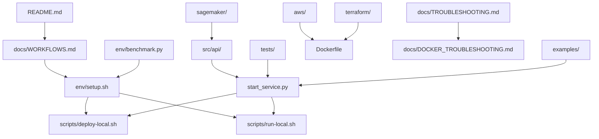

# 📁 Indic-Seamless Service Project Structure

This document outlines the complete project structure and organization of the Indic-Seamless Speech-to-Text Service.

---

## 🏗️ **Directory Overview**

```
indic_seamless_service/
├── 📄 README.md                    # Main project documentation
├── 📄 PROJECT_STRUCTURE.md         # This file - project organization guide
├── 📄 .gitignore                   # Git ignore rules
├── 📄 Dockerfile                   # Container configuration
├── 📄 start_service.py             # Service startup script
├── 📄 env.example                  # Environment configuration template
│
├── 📁 src/                         # 🏗️ Structured Source Code
│   ├── 📁 config/                  # ⚙️ Configuration Management
│   │   ├── __init__.py             # Config module exports
│   │   ├── settings.py             # Application settings
│   │   └── languages.py           # Language configurations
│   │
│   ├── 📁 types/                   # 📋 Type Definitions
│   │   ├── __init__.py             # Types module exports
│   │   ├── schemas.py              # Pydantic request/response models
│   │   └── models.py               # Internal data structures
│   │
│   ├── 📁 utils/                   # 🔧 Utility Functions
│   │   ├── __init__.py             # Utils module exports
│   │   ├── audio.py                # Audio processing utilities
│   │   ├── model.py                # Model loading and processing
│   │   └── logging.py              # Logging configuration
│   │
│   └── 📁 api/                     # 🌐 API Layer
│       ├── __init__.py             # API module exports
│       ├── app.py                  # FastAPI application factory
│       └── routes.py               # API route definitions
│
├── 📁 docs/                        # 📚 Documentation
│   ├── README.md                   # Documentation index
│   ├── DEPENDENCIES.md             # Dependency management guide
│   ├── TROUBLESHOOTING.md          # General troubleshooting
│   ├── WORKFLOWS.md                # Development workflows
│   └── DOCKER_TROUBLESHOOTING.md   # Docker-specific help
│
├── 📁 env/                         # 🔧 Environment Management
│   ├── setup.sh                    # Environment setup script
│   ├── activate.sh                 # Environment activation helper
│   ├── benchmark.py                # Performance benchmarking
│   ├── requirements.in             # Dependency specifications
│   └── requirements.txt            # Pinned dependencies
│
├── 📁 scripts/                     # 🚀 Deployment Scripts
│   ├── deploy-local.sh             # Docker deployment
│   └── run-local.sh                # Development deployment
│
├── 📁 tests/                       # 🧪 Test Suite
│   ├── test_service.py             # Service unit tests
│   └── workflow_test.py            # Integration tests
│
├── 📁 examples/                    # 💡 Usage Examples
│   ├── client_example.py           # Client implementation example
│   └── test_enum_display.py        # Language enum demonstration
│
├── 📁 aws/                         # ☁️ AWS Deployment
│   ├── deploy.sh                   # AWS ECS deployment script
│   └── cloudformation.yaml         # CloudFormation template
│
├── 📁 terraform/                   # 🏗️ Infrastructure as Code
│   └── main.tf                     # Terraform configuration
│
└── 📁 sagemaker/                   # 🤖 SageMaker Deployment
    ├── deploy.py                   # SageMaker deployment script
    ├── inference.py                # SageMaker inference handler
    └── client_example.py           # SageMaker client example
```

---

## 🏗️ **Application Architecture**

The service uses a **structured modular architecture** with the following components:

### **Structured Architecture (`src/`)**
- **Configuration Layer** (`src/config/`) - Centralized settings and language configurations
- **Type System** (`src/types/`) - Pydantic schemas and internal data models
- **Utilities** (`src/utils/`) - Reusable audio processing, model loading, and logging utilities
- **API Layer** (`src/api/`) - Clean separation of routes and application factory
- **Environment Configuration** - Support for `.env` files and environment variables
- **Service Launcher** (`start_service.py`) - Production-ready service startup with health checks

### **Core Features**
1. **Model Loading** - Lazy loading of the AI model on first request
2. **Audio Processing** - Built-in support for multiple audio formats  
3. **Language Support** - 98+ languages with full name display in API docs
4. **Error Handling** - Comprehensive error handling and logging
5. **Configuration Management** - Environment-based configuration

---

## 📋 **Component Details**

### **🚀 Core Application**

| File | Purpose | Description |
|------|---------|-------------|
| `start_service.py` | Service Launcher | Configurable service startup with health checks |
| `Dockerfile` | Containerization | Docker image configuration for deployment |

### **📚 Documentation (`docs/`)**

| File | Purpose | Description |
|------|---------|-------------|
| `DEPENDENCIES.md` | Dependency Guide | Package management and requirements |
| `TROUBLESHOOTING.md` | General Help | Common issues and solutions |
| `WORKFLOWS.md` | Development Guide | Step-by-step workflows and commands |
| `DOCKER_TROUBLESHOOTING.md` | Docker Help | Docker-specific issues and fixes |

### **🔧 Environment Management (`env/`)**

| File | Purpose | Description |
|------|---------|-------------|
| `setup.sh` | Environment Setup | Automated uv virtual environment creation |
| `activate.sh` | Quick Activation | Helper script for environment activation |
| `benchmark.py` | Performance Testing | ML library and model loading benchmarks |
| `requirements.in` | Dependency Specs | High-level dependency definitions |
| `requirements.txt` | Pinned Dependencies | Exact versions for reproducibility |

### **🚀 Deployment Scripts (`scripts/`)**

| File | Purpose | Description |
|------|---------|-------------|
| `deploy-local.sh` | Docker Deployment | Local containerized deployment |
| `run-local.sh` | Development Mode | Direct Python execution for development |

### **🧪 Testing Suite (`tests/`)**

| File | Purpose | Description |
|------|---------|-------------|
| `test_service.py` | Unit Tests | FastAPI endpoint and service testing |
| `workflow_test.py` | Integration Tests | End-to-end workflow validation |

### **💡 Examples (`examples/`)**

| File | Purpose | Description |
|------|---------|-------------|
| `client_example.py` | Client Usage | Python client implementation example |

### **☁️ Cloud Deployment**

#### **AWS (`aws/`)**
| File | Purpose | Description |
|------|---------|-------------|
| `deploy.sh` | ECS Deployment | Automated AWS ECS deployment |
| `cloudformation.yaml` | Infrastructure | AWS resource definitions |

#### **Terraform (`terraform/`)**
| File | Purpose | Description |
|------|---------|-------------|
| `main.tf` | Infrastructure | Terraform configuration for AWS |

#### **SageMaker (`sagemaker/`)**
| File | Purpose | Description |
|------|---------|-------------|
| `deploy.py` | Model Deployment | SageMaker endpoint deployment |
| `inference.py` | Inference Handler | SageMaker inference logic |
| `client_example.py` | SageMaker Client | Example SageMaker client usage |

---

## 🎯 **Usage Patterns**

### **📖 Getting Started**
1. **Read**: `README.md` → `docs/WORKFLOWS.md`
2. **Setup**: `env/setup.sh`
3. **Deploy**: `scripts/deploy-local.sh` or `scripts/run-local.sh`
4. **Test**: `tests/workflow_test.py`

### **🔧 Development**
1. **Environment**: `env/activate.sh`
2. **Development**: `scripts/run-local.sh`
3. **Testing**: `tests/test_service.py`
4. **Benchmarking**: `env/benchmark.py`

### **🚀 Production Deployment**
1. **Local**: `scripts/deploy-local.sh`
2. **AWS ECS**: `aws/deploy.sh`
3. **Terraform**: `terraform/main.tf`
4. **SageMaker**: `sagemaker/deploy.py`

### **❓ Troubleshooting**
1. **General**: `docs/TROUBLESHOOTING.md`
2. **Docker**: `docs/DOCKER_TROUBLESHOOTING.md`
3. **Dependencies**: `docs/DEPENDENCIES.md`
4. **Workflows**: `docs/WORKFLOWS.md`

---

## 🔄 **File Relationships**



---

## 🏷️ **File Categories**

### **📱 User-Facing**
- `README.md` - Primary entry point
- `docs/WORKFLOWS.md` - User workflows
- `examples/client_example.py` - Usage examples

### **🔧 Development**
- `env/` - Environment management
- `scripts/` - Local deployment
- `tests/` - Quality assurance

### **🚀 Production**
- `Dockerfile` - Containerization
- `aws/` - AWS deployment
- `terraform/` - Infrastructure
- `sagemaker/` - ML deployment

### **📚 Documentation**
- `docs/` - Comprehensive guides
- `PROJECT_STRUCTURE.md` - This file

---

## 📊 **Metrics**

- **Total Files**: 25
- **Lines of Code**: 5,682
- **Documentation**: 4 guides
- **Deployment Options**: 4 (Local, Docker, AWS, SageMaker)
- **Test Coverage**: Unit + Integration tests
- **Languages**: Python, Shell, YAML, Markdown

---

*This structure promotes maintainability, scalability, and ease of use for developers at all levels.* 